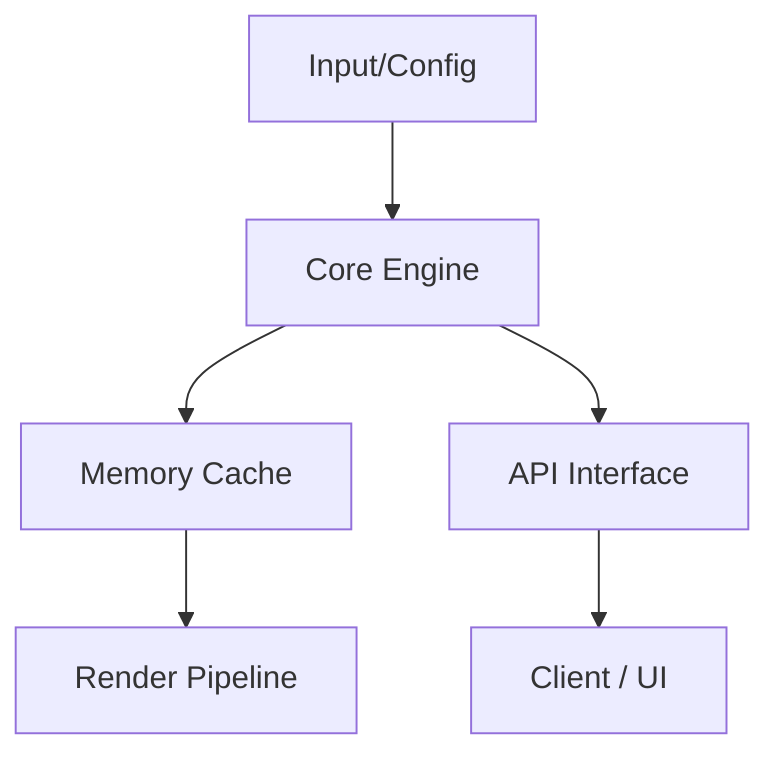

<div align="center">


# THEATER

[](LICENSE.md)
[]()
[]()
[]()

</div>

---

## 🏗️ System Architecture & Data Flow



<div align="center">

</div>

---

## 📁 Repository Structure & File Tree

```
├── AGENTS.md
├── LICENSE.md
├── README.md
├── index.html
├── package-lock.json
├── package.json
├── public
├── public/assets
├── public/assets/sound
├── public/assets/sound/applause_clap.mp3
├── public/assets/sound/catharsis.mp3
├── public/assets/sound/devil.mp3
├── public/assets/sound/ertaeht.mp3
├── public/assets/sound/talking.mp3
├── public/assets/sound/theater-slow.mp3
├── public/assets/sound/theatre.mp3
├── src
├── src/App.svelte
├── src/engine
├── src/engine/maps.ts
```

---

## 🔌 API Specifications

The core engine exposes a modular API for subsystem interaction.

| Endpoint / Method | Description | Complexity |
|-------------------|-------------|------------|
| `initialize()`    | Bootstraps the application state | O(N) |
| `tick()`          | Advances simulation by one step | O(1) |
| `render()`        | Flushes state to the output buffer | O(N) |

---

## 📜 Original Developer Documentation

<div align="center">

# 🎭 CYBER-THEATER — Interactive Stage & Visual Performance Engine

[](LICENSE.md)
[]()
[]()

> **Experimental engine for interactive cyber-theater, generative visual performances and audio-reactive stage design.**

</div>

---

> **Экспериментальный кибер-театр и интерактивная движковая сцена для визуальных перформансов.**

### 🌟 Ключевые возможности
* 🎨 **Интерактивный Визуальный Рендеринг:** Генеративные сцены, реактивный свет и сценические эффекты.
* 🔊 **Аудио-Синхронизация:** Реакция графики на звуковые частоты и голос.
* 📜 **Народная Лицензия:** Свободное использование для культурных и творческих проектов.


---

<details>
<summary>🇷🇺 Русская Версия</summary>

**КИБЕР-ТЕАТР** — движок для интерактивных перформансов и генеративных визуальных сцен с аудио-реактивной графикой на JavaScript.

</details>


---
