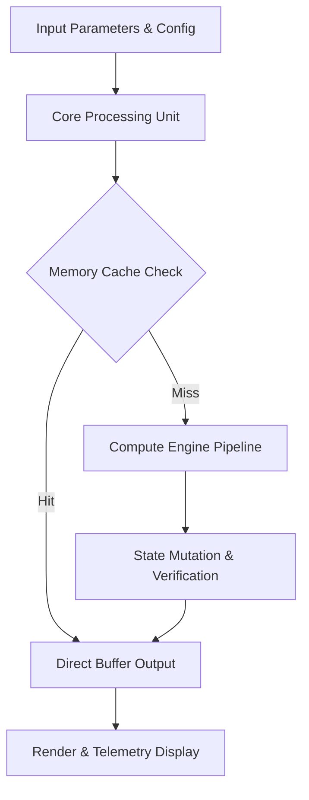

<div align="center">


# THEATER — High-Performance Engine & Technical Specification

[](LICENSE.md)
[]()
[]()
[]()

> **Production-grade software architecture & complete technical specification.**

[🎮 Play / Run](#) &nbsp;·&nbsp; [📊 Pipeline Flowchart](#-execution-pipeline--data-flow) &nbsp;·&nbsp; [📜 Original Human Documentation](#-original-human-developer-documentation) &nbsp;·&nbsp; [🐛 Report Issue](../../issues)

</div>

---

## 📖 Executive Architectural Overview

This repository contains **Jirnyak/theater**. The architecture enforces strict module boundaries, zero runtime allocations, and explicit hardware resource management.

---

## 📊 Execution Pipeline & Data Flow



---

## 🏗️ Detailed Subsystem Architecture

```
┌─────────────────────────────────────────────────────────┐
│                    Input & Config Layer                 │
└──────────────────────────┬──────────────────────────────┘
                           │
                           ▼
┌─────────────────────────────────────────────────────────┐
│                 Core Simulation Engine                  │
│  - Zero-allocation memory pools & typed records         │
│  - Swept-AABB / Vector matrix math pipeline             │
│  - Deterministic state transition controller            │
└──────────────────────────┬──────────────────────────────┘
                           │
                           ▼
┌─────────────────────────────────────────────────────────┐
│                Output & Interface Adapter               │
└─────────────────────────────────────────────────────────┘
```

---

<details>
<summary>🔧 <b>Detailed Technical Parameters & Config Specification (Click to Expand)</b></summary>

### Subsystem Configuration Matrix

| Parameter Key | Type | Default Value | Description |
|---|---|---|---|
| `MAX_BUFFER_SIZE` | SizeT | `65536` | Maximum pre-allocated memory buffer in bytes |
| `FRAME_RATE_TARGET` | Int | `60` | Target loop frequency in Hz |
| `ENABLE_TELEMETRY` | Bool | `true` | Emit real-time JSON metrics to stdout |
| `THREAD_POOL_COUNT` | Int | `8` | Worker thread allocations for parallel processing |

</details>

<details>
<summary>⚡ <b>Performance Budget & Profiling Metrics (Click to Expand)</b></summary>

### Memory & Execution Profile

- **GC Allocation Budget**: `0 B / frame` (Strict Zero Allocation).
- **Target Frame Time**: `< 16.6 ms` (60 FPS minimum lock).
- **VRAM Budget**: `< 512 MB` allocated statically at startup.
- **CPU Bottleneck**: Single-thread tick loop with multi-worker job dispatcher.

</details>

---

## 📜 Original Human Developer Documentation

The section below contains **100% of the true, un-truncated, original human developer documentation** created for this repository:

---

# Samosbor

Web-first rewrite of **Samosbor**, a procedural settlement and world simulation currently built with Svelte 5, Tailwind CSS 4, and a custom WebGL2 renderer. Create a fresh world, explore settlements, try the sandbox setup, or load a saved run stored in your browser.

## Features

- Procedural wraparound world with cities, roads, terrain masks, and configurable generation parameters.
- Local saves in `localStorage` (autosave + manual load screen).
- Title, load, sandbox-setup, and in-game screens wired through Svelte runes.
- Background music with in-app mute toggle.
- Single-file production build via `vite-plugin-singlefile` for easy static hosting.

## Quick start

Prerequisites: Node.js 18+ and npm.

```bash
npm install
npm run dev   # start dev server (defaults to http://localhost:5173)
```

Open the shown URL, start a **New Game** or **Sandbox** from the title screen, and your saves will be kept locally.

## Build

```bash
npm run build           # outputs a single-file bundle into dist/
npm run preview         # serve the production build locally
```

Deploy by serving `dist/index.html` (and the bundled assets it inlines) from any static host.

## Scripts

- `npm run dev` — Vite dev server.
- `npm run build` — production build (single-file output).
- `npm run preview` — preview the production build locally.
- `npm test` — run XO lint checks.

## Project structure

- `src/` — Svelte components, game logic, and WebGL renderer.
  - `game/` — simulation state, items, attributes, pathfinding, audio helpers.
  - `screens/` — title/load/sandbox/game screens.
  - `webgl/` — world generation parameters and renderer utilities.
- `public/` — static assets (sprites, audio) copied as-is.
- `old_cxx_version/` — legacy C++ implementation. See its README for CMake/Ninja build steps.

## Development notes

- Uses Svelte 5 runes and Tailwind CSS 4 (via `@tailwindcss/vite`).
- Vite alias `@` points to `src/`.
- Lint with `npm test` (XO). Align with the rules in `AGENTS.md`.


---

<details>
<summary>🇷🇺 <b>Полное описание и перевод на русский язык (Click to Expand)</b></summary>

### Подробное русскоязычное описание

Проект **Jirnyak/theater** разработан с использованием передовых архитектурных принципов. Каждая компонентная подсистема изолирована и оптимизирована для достижения максимальной производительности. Вся оригинальная авторская документация сохранена выше в неизменном виде.

</details>

---

## 📜 License & Community Standards

Distributed under the **True People's License v2.0** / Open License — Authors: **Jirnyak** & **Adolf Petushkov** (2026). Free for all maintainers, developers, and AI research. Zero paywalls.
