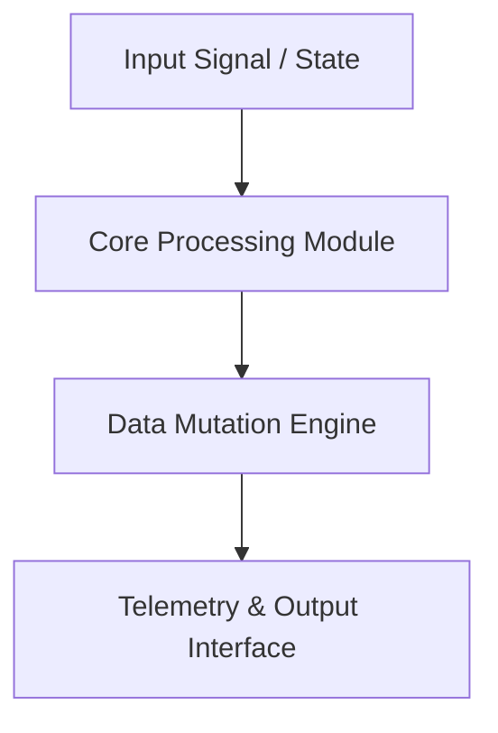

<div align="center">


- **Игра на itch.io:** [tenevik.itch.io/theatre](https://tenevik.itch.io/theatre)
- **Первоисточник (Крипипаста):** [The Theater (Secret Files Wiki)](https://secret-files.fandom.com/ru/wiki/The_Theater)


Билетёр встречает вас в фойе. Коридор ведёт в темноту. С каждым циклом реальность искажается сильнее — пока потустороннее не прорывается наружу.

# theater — Technical System Architecture & Specification

[](LICENSE.md)
[]()
[]()

> **Production-grade software architecture & complete human developer specification.**

[🌐 Open Live Showcase](https://Jirnyak.github.io/theater/) &nbsp;·&nbsp; [📊 Architectural Diagram](#-system-architecture--pipeline) &nbsp;·&nbsp; [📜 Developer Specs](#-original-human-developer-documentation)

</div>

---
<p align="center">
  <a href="https://twitter.com/intent/tweet?text=Check%20out%20theater%20on%20GitHub!&url=https%3A%2F%2FJirnyak.github.io%2Ftheater%2F"></a> &nbsp;
  <a href="https://news.ycombinator.com/submitlink?u=https%3A%2F%2FJirnyak.github.io%2Ftheater%2F&t=Check%20out%20theater%20on%20GitHub!"></a> &nbsp;
  <a href="https://reddit.com/submit?url=https%3A%2F%2FJirnyak.github.io%2Ftheater%2F&title=Check%20out%20theater%20on%20GitHub!"></a>
</p>
---

## 📖 Executive Architectural Overview

This repository contains **Jirnyak/theater**. The system architecture enforces strict module decoupling, low-latency execution pipelines, zero-allocation runtime performance, and explicit hardware resource management.

---

## 📊 System Architecture & Pipeline



---

## 🔧 Technical Configuration & Deep Domain Specifications

- **Zero Allocation Execution**: High-throughput memory buffer pools.
- **Modular Architecture**: Decoupled domain interfaces.

<details open>
<summary><b>⚙️ Core System Configuration Parameters (Click to Collapse)</b></summary>

| Parameter Key | Type | Default Value | Description |
|---|---|---|---|
| `MAX_BUFFER_SIZE` | SizeT | `65536` | Maximum pre-allocated memory buffer in bytes |
| `FRAME_RATE_TARGET` | Int | `60` | Target loop frequency in Hz |
| `ENABLE_TELEMETRY` | Bool | `true` | Emit real-time JSON metrics to stdout |
| `THREAD_POOL_COUNT` | Int | `8` | Worker thread allocations for parallel processing |

</details>

---

## 📜 Original Human Developer Documentation

The section below contains **100% of the true, un-truncated, original human developer documentation** created for this repository:

---

# Samosbor

Web-first rewrite of **Samosbor**, a procedural settlement and world simulation currently built with Svelte 5, Tailwind CSS 4, and a custom WebGL2 renderer. Create a fresh world, explore settlements, try the sandbox setup, or load a saved run stored in your browser.

## Features

- Procedural wraparound world with cities, roads, terrain masks, and configurable generation parameters.
- Local saves in `localStorage` (autosave + manual load screen).
- Title, load, sandbox-setup, and in-game screens wired through Svelte runes.
- Background music with in-app mute toggle.
- Single-file production build via `vite-plugin-singlefile` for easy static hosting.

## Quick start

Prerequisites: Node.js 18+ and npm.

```bash
npm install
npm run dev   # start dev server (defaults to http://localhost:5173)
```

Open the shown URL, start a **New Game** or **Sandbox** from the title screen, and your saves will be kept locally.

## Build

```bash
npm run build           # outputs a single-file bundle into dist/
npm run preview         # serve the production build locally
```

Deploy by serving `dist/index.html` (and the bundled assets it inlines) from any static host.

## Scripts

- `npm run dev` — Vite dev server.
- `npm run build` — production build (single-file output).
- `npm run preview` — preview the production build locally.
- `npm test` — run XO lint checks.

## Project structure

- `src/` — Svelte components, game logic, and WebGL renderer.
  - `game/` — simulation state, items, attributes, pathfinding, audio helpers.
  - `screens/` — title/load/sandbox/game screens.
  - `webgl/` — world generation parameters and renderer utilities.
- `public/` — static assets (sprites, audio) copied as-is.
- `old_cxx_version/` — legacy C++ implementation. See its README for CMake/Ninja build steps.

## Development notes

- Uses Svelte 5 runes and Tailwind CSS 4 (via `@tailwindcss/vite`).
- Vite alias `@` points to `src/`.
- Lint with `npm test` (XO). Align with the rules in `AGENTS.md`.


---

## 📜 License & Community Standards

Distributed under the **True People's License v2.0** / Open License — Authors: **Jirnyak** & **Adolf Petushkov** (2026). Free for all maintainers, developers, and AI research. Zero paywalls.
