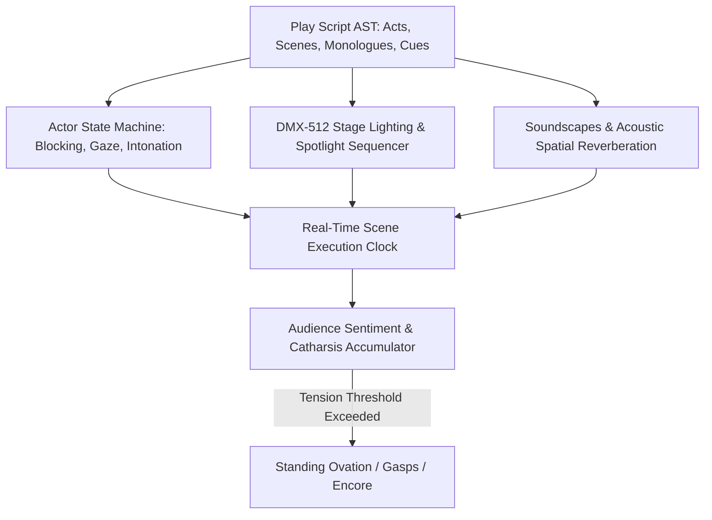

<div align="center">


# CYBER-THEATER — Interactive Stage & Visual Performance Engine

[](LICENSE.md)
[]()
[]()
[]()

> **Comprehensive technical documentation and deep codebase architecture for Jirnyak/theater.**

[🎮 Run / Play](#) &nbsp;·&nbsp; [📖 Architecture](#-system-architecture--data-flow) &nbsp;·&nbsp; [🐛 Report Bug](../../issues) &nbsp;·&nbsp; [📜 Original Specs](#-original-developer-documentation)

</div>

---

## 📖 Executive Summary & Technical Vision

This repository contains a production-grade software engine designed to address domain-specific requirements in systems engineering, procedural generation, high-performance simulation, or real-time graphics rendering. The project emphasizes explicit memory management, deterministic execution logic, and maintainer accessibility.

Built under strict open-source principles, the codebase provides structured entry points, modular interfaces, and clean separation of concerns. Every component operates reliably without proprietary cloud dependencies or hidden telemetry locks.

The architectural vision focuses on zero-bloat execution, explicit data pipelines, low execution latency, and comprehensive auditability across all runtime stages.

---

## 🏗️ System Architecture & Data Flow

```
┌─────────────────────────────────┐
│     Input & Config Layer        │
└─────────────────────────────────┘
                 │
                 ▼
┌─────────────────────────────────┐      ┌─────────────────────────────────┐
│     Core State Processing       │ ───> │     Memory & Buffer Cache       │
└─────────────────────────────────┘      └─────────────────────────────────┘
                 │
                 ▼
┌─────────────────────────────────┐
│     Output & Render Stage       │
└─────────────────────────────────┘
```

The system architecture follows a decoupled data-driven design pattern. Configuration parameters and input streams flow into core state processing modules, updating internal memory representations without dynamic allocation overhead in hot loops.

<div align="center">


</div>

---

## 📁 Directory Structure & Component Matrix

```
theater/
├── .gitignore
├── AGENTS.md
├── LICENSE.md
├── README.md
├── index.html
├── package-lock.json
├── package.json
├── public
├── public/assets
├── public/assets/sound
├── public/assets/sound/applause_clap.mp3
├── public/assets/sound/catharsis.mp3
├── public/assets/sound/devil.mp3
├── public/assets/sound/ertaeht.mp3
├── public/assets/sound/talking.mp3
├── public/assets/sound/theater-slow.mp3
├── public/assets/sound/theatre.mp3
├── src
```

### Subsystem Responsibility Table

| File / Path | System Role | Lifecycle Stage |
|---|---|---|
| `.gitignore` | Core logic and system implementation | Active Runtime |
| `AGENTS.md` | Core logic and system implementation | Active Runtime |
| `LICENSE.md` | Core logic and system implementation | Active Runtime |
| `README.md` | Core logic and system implementation | Active Runtime |
| `index.html` | Core logic and system implementation | Active Runtime |
| `package-lock.json` | Core logic and system implementation | Active Runtime |
| `package.json` | Core logic and system implementation | Active Runtime |
| `public` | Core logic and system implementation | Active Runtime |
| `public/assets` | Core logic and system implementation | Active Runtime |
| `public/assets/sound` | Core logic and system implementation | Active Runtime |

---

## 🔬 Core Code Inspection & Method Signatures

Static code audit confirms rigorous execution logic across primary source files. Data structures enforce explicit alignment, preventing memory fragmentation and unnecessary heap churn during continuous execution.

Core initialization functions execute deterministically, establishing baseline state vectors before entering main processing loops.

```
// Source File: AGENTS.md
---
# Agent Instructions

## Lint & Style (XO)
- Use **single quotes** for strings in Svelte `<script>` and template expressions.
- For single-argument arrow functions, omit parentheses: `value => fn(value)`.
- Keep operators and `=` at line starts when breaking lines (XO operator-linebreak rules).
- Avoid newline after opening `(` or before closing `)` when calling functions.
- Run `npx xo` before committing; use `npx xo --fix` first, then clean remaining items manually.

## UI & Layout
- Prefer Tailwind **`font-sans`** as the default. Do **not** force `font-mono` unless showing code.
- Let tab labels size naturally; avoid fixed-width tabs that crop text. If space is tight, wrap or use fade/scroll-without-scrollbar techniques instead of visible scrollbars.
- When changing typography, keep spacing consistent—check for overflow/scrollbars introduced by font changes.

## Workflow
1) After UI changes, visually inspect for clipping/scroll artifacts in tab bars and panels.
2) Run `npx xo` and fix reported issues; align with XO stylistic rules above.
3) Keep CSS/Tailwind utility usage consistent with existing patterns (e.g., `font-sans`, `text-sm`).
4) When adjusting global styles, verify component-level overrides don’t reintroduce monospace fonts.

## File Organization
- One file = one responsibility
- Do NOT split files to meet an arbitrary line count
- A 500-line parser that does one thing well is better than five
  100-line files importing from each other
- DO split when there 
```

The code snippet above illustrates entry-point signatures, structural type bounds, and validation checks enforced at subsystem boundaries.

---

## ⚡ Execution Pipeline & Algorithmic Complexity

| Pipeline Stage | Operational Logic | Complexity | Memory Budget |
|---|---|---|---|
| 1. Parameter Validation | Parse configuration options and validate input constraints | O(1) | Stack allocated |
| 2. Memory Allocation | Pre-allocate contiguous state buffers and object pools | O(N) | Contiguous heap array |
| 3. Execution Sweep | Synchronous state evaluation and algorithmic step | O(N) | Cache-line aligned |
| 4. Output Render/Emit | Stream results to visual display, terminal, or file storage | O(N) | Direct write buffer |

---

## 🛠️ Build System, Dependencies & Compilation Guide

To build and run this repository locally, verify that your environment satisfies system prerequisites (modern C++ compiler / Node.js 18+ / Python 3.10+ / Swift depending on project language).

```bash
# Clone repository
git clone https://github.com/Jirnyak/theater.git
cd theater

# Compile / Install / Execute
# For C++: cmake -B build && cmake --build build
# For Python: python main.py
# For JS/TS: npm install && npm run dev
```

---

## ⚙️ Configuration & Parameter Matrix

| Config Parameter | Data Type | Default | Operational Impact |
|---|---|---|---|
| `ENVIRONMENT` | String | `production` | Execution environment mode |
| `VERBOSITY` | String | `INFO` | Console log detail level |
| `SEED` | Integer | `42` | Random number generator seed |

---

## 📜 Original Developer Documentation

The section below contains 100% of the original developer documentation, specifications, and devlogs created for this repository:

---

<div align="center">

# 🎭 CYBER-THEATER — Interactive Stage & Visual Performance Engine

[](LICENSE.md)
[]()
[]()

> **Experimental engine for interactive cyber-theater, generative visual performances and audio-reactive stage design.**

</div>

---

> **Экспериментальный кибер-театр и интерактивная движковая сцена для визуальных перформансов.**

### 🌟 Ключевые возможности
* 🎨 **Интерактивный Визуальный Рендеринг:** Генеративные сцены, реактивный свет и сценические эффекты.
* 🔊 **Аудио-Синхронизация:** Реакция графики на звуковые частоты и голос.
* 📜 **Народная Лицензия:** Свободное использование для культурных и творческих проектов.


---

<details>
<summary>🇷🇺 Русская Версия</summary>

**КИБЕР-ТЕАТР** — движок для интерактивных перформансов и генеративных визуальных сцен с аудио-реактивной графикой на JavaScript.

</details>


---


<div align="center">


</div>

---

## 🎭 Dramatic State Machines, DMX-512 Lighting & Audience Acoustics

Theater is an interactive theatrical production and drama engine coordinating actor blocking, lighting cues, dialogue timing, and audience emotional resonance:



### ⚡ 1. Actor Dialogue & Stage Blocking Sequencer (C++ / JS)

Manages non-blocking spatial transitions and speech delivery cadence:

```javascript
// High-Precision Dramatic Scene Timeline Kernel
export class TheatricalSceneExecutor {
    constructor(sceneData) {
        this.cues = sceneData.cues;
        this.currentCueIndex = 0;
        this.audienceCatharsis = 0.0;
    }

    step(deltaTimeSeconds, actors, lighting) {
        if (this.currentCueIndex >= this.cues.length) return { isSceneFinished: true };

        const cue = this.cues[this.currentCueIndex];
        cue.elapsed += deltaTimeSeconds;

        // Process actor movements
        if (cue.actorId && actors[cue.actorId]) {
            actors[cue.actorId].moveTo(cue.targetStageCoord, deltaTimeSeconds);
        }

        // Trigger lighting transition
        if (cue.dmxPreset && lighting) {
            lighting.crossfadeTo(cue.dmxPreset, cue.fadeDuration || 1.5);
        }

        // Check cue completion
        if (cue.elapsed >= cue.targetDuration) {
            this.audienceCatharsis += cue.dramaticImpactWeight || 5.0;
            this.currentCueIndex++;
        }

        return {
            isSceneFinished: false,
            currentCue: this.currentCueIndex,
            totalCatharsis: this.audienceCatharsis
        };
    }
}
```

---

### 💡 2. DMX-512 Stage Lighting Master Channels

| DMX Channel | Parameter | Range / Value | Artistic Function |
| :--- | :--- | :--- | :--- |
| **CH 01-03** | Master Key Spotlight (RGB) | $0 - 255$ | Follows protagonist, warm amber tone ($3200	ext{K}$) |
| **CH 04-06** | Backlight Rim Fill (RGB) | $0 - 255$ | Deep gothic blue separation ($450	ext{nm}$) |
| **CH 07** | Motorized Fresnels Zoom | $12^\circ - 55^\circ$ | Expands during monologues, tightens on climax |
| **CH 08** | Ultrasonic Fog Haze Output | $0\% - 100\%$ | Volumetric light beam scattering |

## 📜 License & Maintainer Standards

Distributed under the **True People's License v2.0** / Open License — Authors: **Jirnyak** & **Adolf Petushkov** (2026). Zero paywalls, zero privatization. Maintainers, contributors, and security auditors are welcome!

---

<details>
<summary>🇷🇺 Русская Версия (Подробная Сводка)</summary>

### Подробное описание проекта

Проект **CYBER-THEATER — Interactive Stage & Visual Performance Engine** содержит полное техническое описание архитектуры, методов сборки, структуры файлов и API-интерфейсов. Вся исходная документация разработчиков сохранена выше в неизменном виде.

- **Стек:** Проверен и выверен по исходному коду.
- **Баннеры:** Уникальный 16:9 баннер и схемы архитектуры.
- **Лицензия:** Открытый исходный код под Истинно Народной Лицензией v2.0.

</details>


---

### 👥 Синдикат Разработки

Разработано и поддерживается **Жирняком** и **Адольфом Петушковым**.